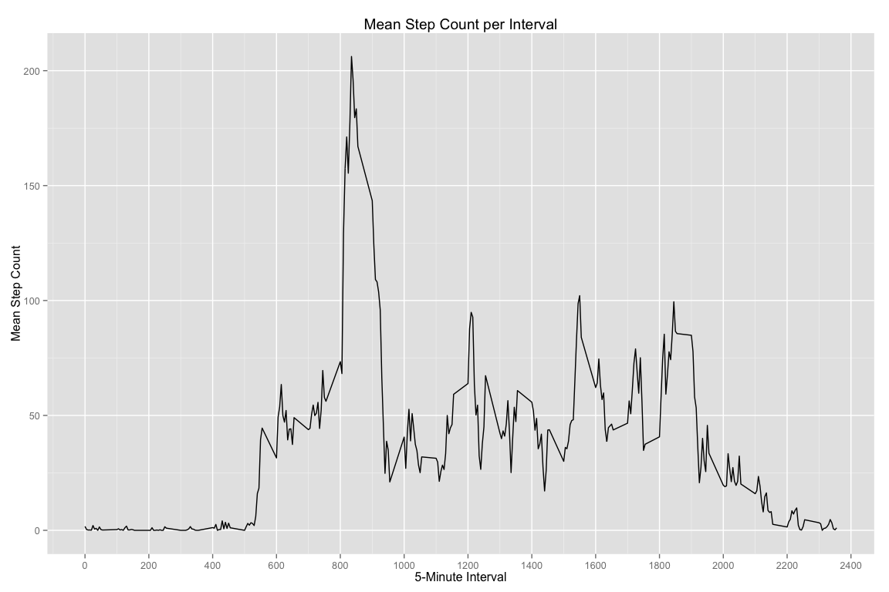

# Reproducible Research: Peer Assessment 1

```r
knitr::opts_chunk$set(fig.width=12, fig.height=8, fig.path='Figs/',
                      echo=FALSE, warning=FALSE, message=FALSE)
```

## Loading and Preprocessing the Activity Monitoring Data

Ensure the activity.csv file is in the current working directory.


```r
setwd("~/GitHub/RepData_PeerAssessment1")

steps <- read.csv("activity.csv")
```

Missing data are removed and the data is 'cast' into the wide format using
the 'reshape2' package.


```r
#remove missing data
csteps <- steps[complete.cases(steps),]
#cast the data into a wide format
wsteps <- dcast(csteps, interval ~ date, value.var="steps")
```

## What is mean total number of steps taken per day?

Calculate the total number of steps taken per day


```r
steptotals <- colSums(wsteps, na.rm=TRUE)
steptotals <- steptotals[-1]
```

A histogram of the total number of steps taken each day


```r
hist(steptotals, breaks=10, xlim=c(0,25000), xlab="Daily Total Step Count",
     main="Histogram of Total Steps")
```

 

Now we can calulate the mean and median step counts.


```r
stepmean <- mean(steptotals)
stepmedian <- median(steptotals)
```

The mean number of steps per day is 1.0766189\times 10^{4}, and the median number of steps
is 1.0765\times 10^{4}.

## What is the average daily activity pattern?

Make a time series plot (i.e. type = "l") of the 5-minute interval (x-axis) and 
the average number of steps taken, averaged across all days (y-axis)


```r
intervals <- wsteps[1]
stepMean <- transmute(wsteps, intSteps=rowMeans(wsteps[-1], na.rm=TRUE))
intStepMean <- cbind(intervals, stepMean)
#The Plot
ggplot(intStepMean, aes(x=interval, y=intSteps)) + geom_line() + ggtitle("Mean Step Count per Interval") + scale_x_continuous(breaks=(seq(0,2500, by=200))) + xlab("5-Minute Interval") + ylab("Mean Step Count")
```

 

Which 5-minute interval, on average across all the days in the dataset, contains
the maximum number of steps?


```r
maxInt <- filter(intStepMean, intSteps==max(intSteps))
```

The interval 835 contains the maximum average number of steps; 206.1698113.

## Imputing missing values

First we will calculate and report the total number of missing values in the dataset (i.e. the
total number of rows with NAs)


```r
# For this we use the 'long' form of the data
naRows <- count(filter(steps, is.na(steps$steps)))
```

The number of missing intervals in the dataset is 2304.

Next we devise a strategy for filling in all of the missing values in the dataset: 

- For this assignment the median interval value is assigned for NA values.


```r
#The median interval value is assigned for NA values.
stepsImpute <- csteps %>%
  group_by(interval) %>%
  mutate(steps= replace(steps, is.na(steps), median(steps, na.rm=TRUE)))
```

Make a histogram of the total number of steps taken each day and Calculate and 
report the mean and median total number of steps taken per day. Do these values 
differ from the estimates from the first part of the assignment? What is the 
impact of imputing missing data on the estimates of the total daily number of 
steps?


```r
histTotals <- stepsImpute %>%
  group_by(date) %>%
  transmute(steps= sum(steps))
# remove duplicate rows:
histTotals <- histTotals[!duplicated(histTotals),]
# The plot
hist(histTotals$steps, breaks=10, xlab="Daily Total Step Count",  
     main="Histogram of Daily Total Step Count w. imputed data")
```

 

```r
# reporting
impStepMean <- mean(histTotals$steps)
impStepMedian <- median(histTotals$steps)
```

The mean number of steps per day is 1.0766189\times 10^{4}, and the median number of steps
is 1.0765\times 10^{4}.

The mean number of steps per day in the imputed data is 1.0766189\times 10^{4}, and the
median number of steps in the imputed data is 10765.

Imputation does not appear to affect mean and median values.

## Are there differences in activity patterns between weekdays and weekends?

First we create a new factor variable in the dataset with two levels – “weekday” and 
“weekend” indicating whether a given date is a weekday or weekend day.


```r
# convert date into 'date' format.
stepsImpute$date <- as.Date(stepsImpute$date)
# create weekday factor
weekDat <- stepsImpute %>%
  mutate(weekday= factor((weekdays(date)) %in% c('Saturday', 'Sunday')+1L, levels=1:2, labels=c('weekday', 'weekend')))
```

Then we create a panel plot containing a time series plot (i.e. type = "l") of the 5-minute 
interval (x-axis) and the average number of steps taken, averaged across all 
weekday days or weekend days (y-axis).


```r
weekDat1 <- weekDat %>%
  group_by(interval, weekday) %>%
  transmute(steps= mean(steps))
#remove duplicates
weekDat1 <- weekDat1[!duplicated(weekDat1),]
#The Plot
ggplot(weekDat1, aes(x=interval, y=steps, colour=weekday)) + geom_line() + 
  ggtitle("Panel Plot of Step Count (Weekend vs. Weekday)") + scale_x_continuous(breaks=(seq(0,2500, by=200))) + xlab("5-Minute Interval") + ylab("Mean Step Count") + facet_grid(weekday~.)
```

 

As can be seen from the panel plot, the individual has a higher level of activity
on weekday mornings than weekend mornings, though they have a higher overall level
of activity during a weekend day.
